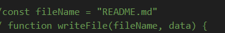

# Readme Generator 

<h2 align="center">
   Jacobs ReadMe Generator
</h2>

  

   No hands needed

  

    An awesome way to quickly write a professional readme!
  

  
<h2 align="center"> Description</h2>
 

The Generator helps you quickly make a readme file for any project.
It takes user input and inserts it into a template readme for a professional look.
With the information you want.

<h2 align="center">Installation</h2>

Available with JavaScript code

[ReadMe Generator]

([https://dupeaj.github.com/NoMouseNeededReadme/])

steps required

Install inquirer version 8.2.4 and init -y

## Usage
Initialize node package manager and make sure packages are installed, then run index.js and answer prompts. take the generated ReadMe file and copy into project repository.

## License
refer to repo for licenses

license is a General MIT license.

## Badges

## Features
<li>prompts user input,</li>
<li>prompts license selection,</li>
<li>writes file for user,</li>

## How to Contribute
open an issue or push a merge with updates.
